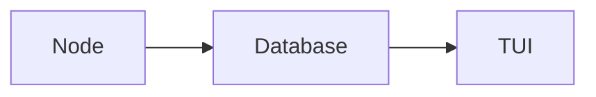

# Design #

`blocktop`, being a block explorer, necessarily indexes the blockchain being explored. Blockchain data is retrieved directly from the specified RPC node via a supported transport (see [`FUNCTIONALITY`](docs/FUNCTIONALITY.md)). At a high level, this is simply the blocks themselves. This data is then inserted into a local SQLite database (either in-memory or on-disk). The UI then retrieves this data directly from the database, caching only what's necessarily to ensure a sufficiently low latency user experience.



`blocktop` is mulithreaded: RPC node communication, database connection, and the UI each have their own threads.

## Database Schema ##

**This is not stable yet**. In general, blockchain objects are stored in a flat manner (so no ER normalisation for the different EIP-2718 transaction subtypes, for instance).

Right now, for an authoritative answer, read the `Database::initialise` function or do this:

```
$ blocktop --db foobar.db
$ sqlite3 foobar.db
sqlite> .schema
```

